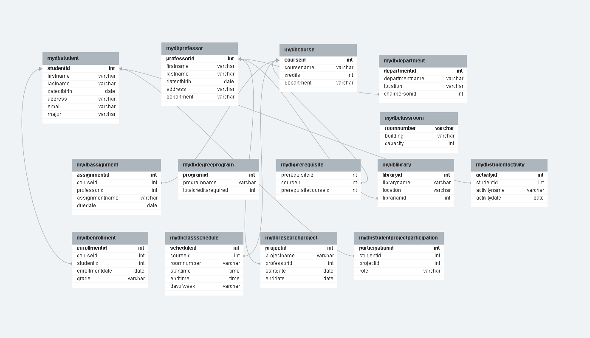

# University Database README

Welcome to the University Database project! This database is designed to manage and organize information related to a university, including students, professors, courses, enrollments, and more.

## Table of Contents

- [Overview](#overview)
- [Database Structure](#database-structure)
- [Getting Started](#getting-started)
- [Data Sample](#data-sample)
- [Contributing](#contributing)
- [License](#license)

## Overview

This project aims to create a comprehensive database system for a university environment. The database includes tables for students, professors, courses, enrollments, departments, assignments, degree programs, prerequisites, libraries, and more. The relationships between these entities are carefully designed to represent the complex interactions within a university ecosystem.

## Database Structure

The database schema includes the following tables:

- **Student**: Information about university students.
- **Professor**: Details about professors working at the university.
- **Course**: Descriptions of courses offered by the university.
- **Department**: Information about university departments.
- **Enrollment**: Records of student enrollments in specific courses.
- **Classroom**: Details about classrooms available for courses.
- **Assignment**: Descriptions of assignments given to students.
- **DegreeProgram**: Information about degree programs offered.
- **Prerequisite**: Details about course prerequisites.
- **Library**: Information about university libraries and librarians.
- **StudentActivity**: Records of extracurricular activities involving students.
- **ClassSchedule**: Schedules for classes including courses, rooms, and timings.
- **ResearchProject**: Details about ongoing research projects.
- **StudentProjectParticipation**: Records of student participation in research projects.



## Getting Started

To set up the university database on your system, follow these steps:

1. **Clone the Repository**: `git clone [repository_url]`
2. **Import the Database**: Use the provided SQL script to create the database structure and import sample data.
3. **Modify Data**: Customize the data according to your requirements.
4. **Run Queries**: Utilize SQL queries to interact with the database.

## Data Sample

Here is a sample set of data for a few tables:

```sql
-- Inserting data into the Student table
INSERT INTO Student (FirstName, LastName, DateOfBirth, Address, Email, Major)
VALUES
  ('John', 'Doe', '1995-05-15', '123 Main St, Cityville', 'john.doe@email.com', 'Computer Science'),
  ('Jane', 'Smith', '1998-08-22', '456 Oak St, Townsville', 'jane.smith@email.com', 'Biology');
  
-- Inserting data into the Professor table
INSERT INTO Professor (FirstName, LastName, DateOfBirth, Address, Email, Department)
VALUES
  ('Michael', 'Johnson', '1970-02-28', '789 Pine St, Villageton', 'michael.johnson@email.com', 'Computer Science'),
  ('Sarah', 'Miller', '1985-09-12', '101 Elm St, Hamletville', 'sarah.miller@email.com', 'Biology');
  
-- ... (Additional INSERT statements for other tables)
